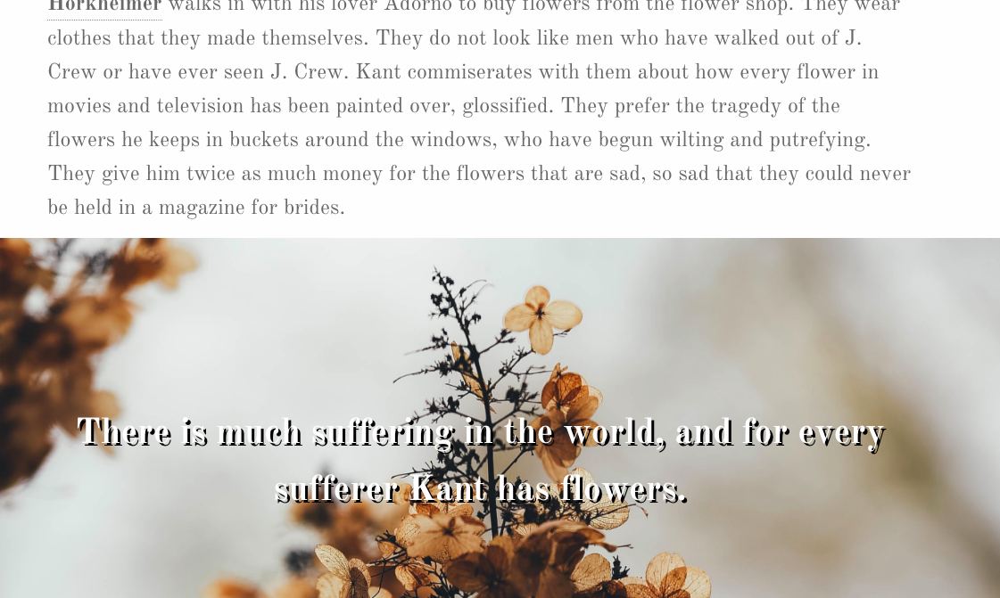

<h1> Behind the Universe </h1>

 a weekend long front-end hackathon & short story 

<h2>Goals</h2>
<h3>"Learn something new and build something cool in a weekend."
</h3>

For a weekend assignment, we were encouraged to learn new front-end libraries and put into practice some basic principles for them. I decided to learn Foundation and Skrollr because I knew I wanted to implement both technologies in later projects. I learned about the standardization of various grid systems used for front-end design work and about creating front-end effects that complement rather than pull attention away from content on the page.

<h2>Strategy Used</h2>

I started by settling on the content of the project, a short story I had written for a philosophy course. I included the front-end frameworks and began working with Foundation's documention to achieve a clean, almost book-ish basic layout for the text. Once the base was established, my focus was otherwise on learning simple Skrollr techniquest that would show off the data (in this case, text and images) that I wanted to emphasize.

<h2>Technologies Learned</h2>

 Foundation, Skrollr 

<h2>Other Technologies Used</h2>

 Javascript, CSS, HTML, JQuery & a little magic 

<h2>Installing</h2>

Copy and clone to computer. Open the index.html file in browser. 

<h2>Contributing Content</h2>

 images used from unsplash 

